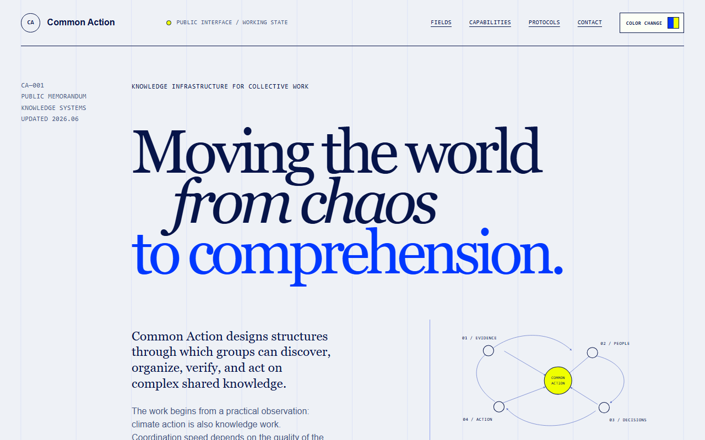
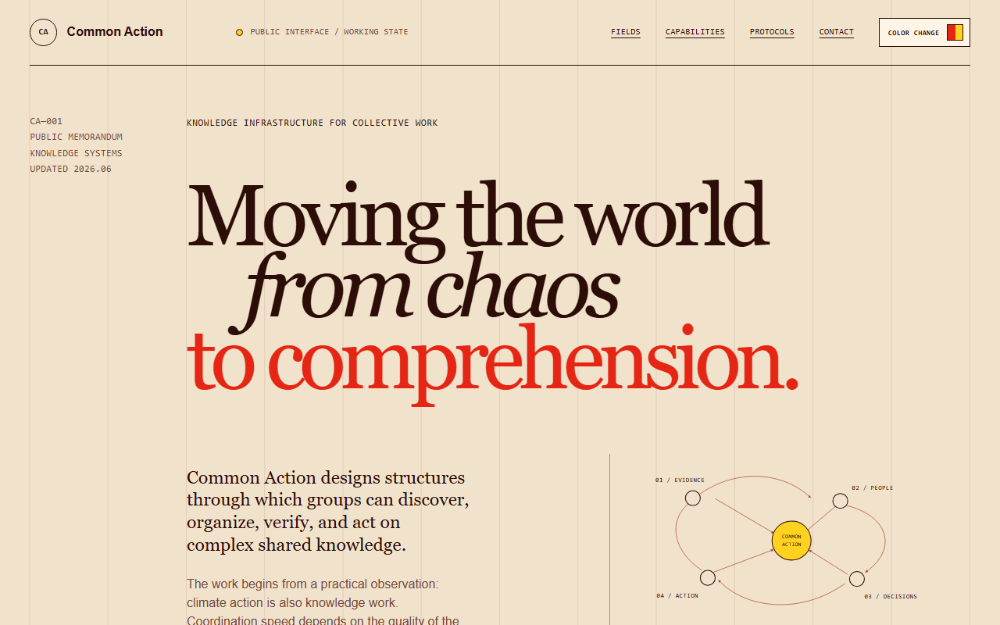
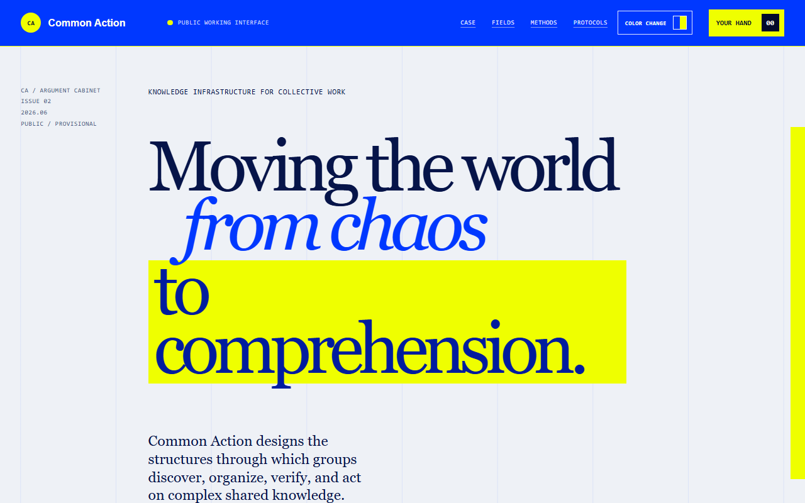
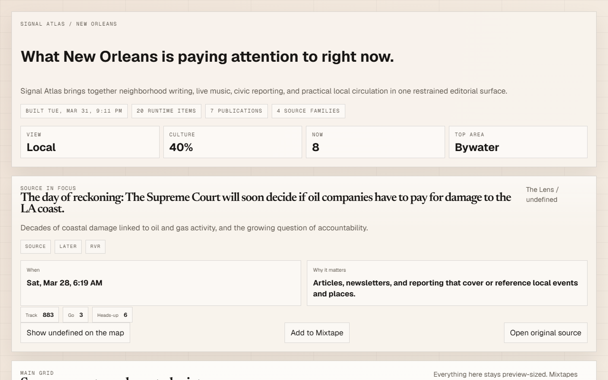
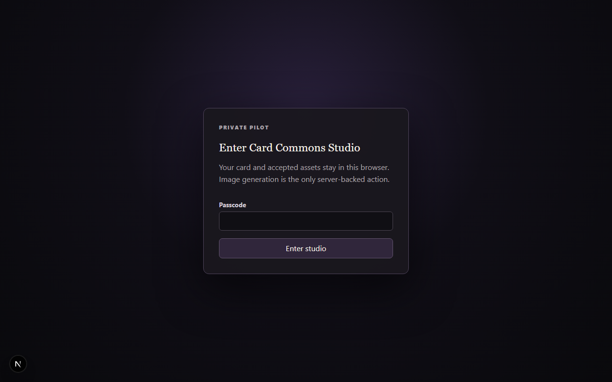

# ca-complex

The deployable monorepo for the Common Action constellation: five apps, two
shared packages, one root gate. Five Vercel projects come from this one repo;
nothing here requires a build tool the app didn't already have.

| App | What it is | Source |
|---|---|---|
| `apps/action` | Evidentiary brochure — a single-page public memorandum | former `common-action` |
| `apps/pitch` | Argument cabinet — an interactive persuasion deck | former `common-pitch` |
| `apps/atlas` | Signal Atlas — a New Orleans local-intelligence map + feed | former `on-high-in-blue-tomorrows` |
| `apps/cards` | Card Commons publication site — spec, whitepaper, research | former `card-commons/site` |
| `apps/studio` | Card Studio — a gated pilot card editor | former `card-commons/studio` |

Plus `packages/contracts` (`@ca/contracts`, the schema source of truth for card
documents) and `packages/tokens` (`@ca/tokens`, the single source for the
shared `ultraviolet` / `suited-chili` palette). Full source-to-destination
mapping, with final commit SHAs, is in `MIGRATION.md`.

## Screenshots


`apps/action` — the evidentiary memorandum, default ultraviolet scheme.


`apps/action` — suited-chili scheme, showing the corrected `--vermilion`
accent (`#e52614`, replacing an older `#ff4b1f` value carried over from a
mis-copy — see `MIGRATION.md`).


`apps/pitch` — the argument cabinet, card-flip deck view.


`apps/atlas` — Signal Atlas, the New Orleans map and feed.


`apps/cards` — the Card Commons publication site.


`apps/studio` — Card Studio, the gated pilot editor.

## The whitepaper

`whitepaper/card-commons.md` — "Card Commons: A smaller creative primitive for
the web" — argues that everyday web creation is organized around containers
larger than most ideas (the site, the page, the app) and proposes the card as
a smaller, portable, publishable unit. Status: proposal, v0.1.0, not a shipped
result.

## The constellation

ca-complex is one of three repos. `ca-vault` (private) holds the agent
doctrine and the knowledge base describing what's deployed here. `ca-graph`
(private) is the ontology backbone — the knowledge-graph substrate the
constellation's own thesis rests on. Neither is required to build or run
ca-complex; this repo stands alone when cloned bare.

## Quickstart

> Windows: clone to a short path (e.g. `C:  cs`) — Turbopack build
> artifacts can exceed MAX_PATH in deep folders.

```bash
npm ci
npm run check
```

Per-app dev servers, from the repo root:

```bash
npm run dev --workspace @ca/atlas    # scripts/dev-server.mjs
npm run dev --workspace @ca/cards    # next dev
npm run dev --workspace @ca/studio   # next dev --port 3100
```

`apps/action` and `apps/pitch` are buildless static sites with no dev script —
serve `apps/action/public` or `apps/pitch/public` with any static file server.

## The gate

Every workspace declares its own `check`; the root `npm run check` runs
`check:root` (`lint:md`, `validate:schemas`, `validate:openapi`,
`tokens:check`, `fixtures:check`) and then every workspace's own `check`.
Browser end-to-end tests (cards + studio) are separate: `npm run
check:browser`. A defect the gate should have caught ships with a regression
assertion added to that gate, not just a code fix.

## Lore

App names here are functional (`action`, `pitch`, `atlas`, `cards`, `studio`).
Each app carried a more poetic name in its former repo — that history lives in
each app's own `README.md`, not here.
